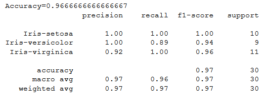
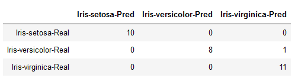

# Logistic Regression Algorithm
Logistic Regression is a binary classifier used to classify linearly seperable data.

## Dataset Description
The Iris dataset can be found on the UCI Machine Learning Repository. It includes three iris species (Iris-setosa, Iris-versicolor and Iris-virginica) with 50 samples each as well as some properties about each flower.

The columns in this dataset are:
* Id
* SepalLengthCm
* SepalWidthCm
* PetalLengthCm
* PetalWidthCm
* Species

### Since number of class in the dataset is 3, hence its a multiclass classification problem. To solve this problem One vs Rest algorithm is used

## Results
One fifth of dataset (30 samples) are used for testing purpose and model predicted with 96% test accuracy.
#### Acruccay,Precision,Recall and F1-score

#### Confusion Matrix

